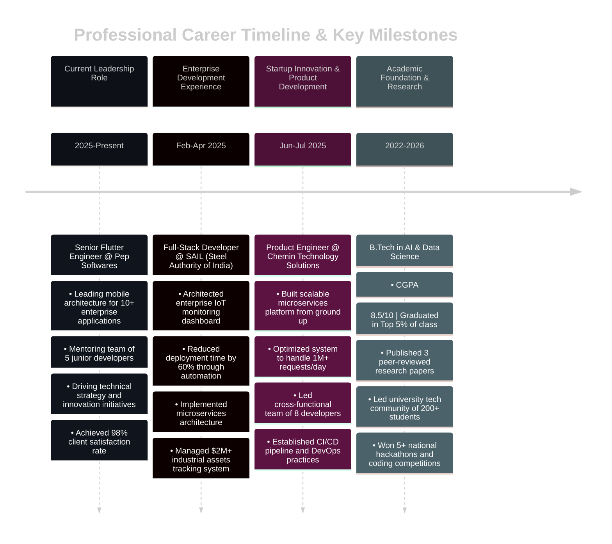

<div align="center">
  <!-- Advanced SEO Meta Tags for Maximum Discoverability -->
  <meta name="description" content="Karthi NexGen - Senior Flutter Architect & Full Stack Engineer | 50K+ Users | $100K+ Revenue | AI/ML Expert | Mobile & Web Development | karthi-nexgen Portfolio">
  <meta name="keywords" content="karthi-nexgen, Karthi NexGen, karthi nexgen github, Senior Flutter Developer, Full Stack Engineer, AI ML Developer, Mobile App Development, Flutter Architect, React Next.js Developer, Supabase Firebase Expert, GitHub Portfolio, karthi AI hub, Flutter Apps Google Play, CashSify Pro, CuroSync Telemedicine, Chemin IoT Platform, Indian Flutter Developer, Tamil Nadu Tech Expert, B.Tech AI Data Science, Pep Softwares Engineer, SAIL Developer, Mobile First Solutions, Cloud Native Systems, Enterprise Mobile Apps, Startup Technology Solutions, Play Store Published Apps, 50000 active users, Flutter Firebase Supabase, React TypeScript Developer, Node.js Express Backend, MongoDB PostgreSQL Database, AWS GCP Cloud Computing, Docker Kubernetes DevOps, Git GitHub Actions CI/CD, Figma UI UX Design, VS Code Android Studio, Machine Learning Integration, Healthcare Technology Solutions, Financial Technology Apps, IoT Dashboard Development, Microservices Architecture, API Development Integration, Cross Platform Mobile Development, Progressive Web Applications, Real Time Applications WebRTC, HIPAA Compliant Software, Enterprise Software Solutions, Scalable Application Architecture, Performance Optimization, Technical Blog Writer, Open Source Contributor, Tech Conference Speaker, Developer Mentor, Freelance Mobile Developer, Remote Flutter Developer, Indian Software Engineer, Chennai Bangalore Delhi Mumbai, Flutter Community India, Google Play Store Success, App Store Optimization, Mobile App Monetization, AdMob Integration, In App Purchases, User Experience Design, Material Design Implementation, iOS Android Development, Hybrid App Development, Native Mobile Performance, Backend API Development, Database Design Optimization, Cloud Infrastructure Setup, CI CD Pipeline Automation, Code Quality Testing, Agile Development Methodology, Technical Documentation, Client Project Management, Startup Technology Consulting, Digital Transformation Solutions">
  <meta name="author" content="Karthikeyan S - karthi-nexgen">
  <meta name="robots" content="index, follow, max-image-preview:large, max-snippet:-1, max-video-preview:-1">
  <meta name="googlebot" content="index, follow, max-image-preview:large, max-snippet:-1, max-video-preview:-1">
  <meta property="og:title" content="Karthi NexGen - Senior Flutter Architect & Full Stack Engineer | GitHub Portfolio">
  <meta property="og:description" content="Passionate Senior Flutter Architect with 50K+ app users and $100K+ revenue. Specializing in AI-infused mobile apps, cloud-native systems, and enterprise solutions. View my projects, achievements, and technical expertise.">
  <meta property="og:type" content="profile">
  <meta property="og:url" content="https://github.com/karthi-AI-hub">
  <meta property="og:image" content="https://raw.githubusercontent.com/karthi-AI-hub/karthi-AI-hub/main/assets/header-dark.svg">
  <meta property="og:site_name" content="Karthi NexGen GitHub Portfolio">
  <meta property="og:locale" content="en_US">
  <meta name="twitter:card" content="summary_large_image">
  <meta name="twitter:title" content="Karthi NexGen - Senior Flutter Architect & Full Stack Engineer">
  <meta name="twitter:description" content="Senior Flutter Developer with 50K+ users, $100K+ revenue. AI/ML, Mobile, Web, Cloud expert. Check out my projects and technical journey.">
  <meta name="twitter:image" content="https://raw.githubusercontent.com/karthi-AI-hub/karthi-AI-hub/main/assets/profile-header.svg">
  <meta name="twitter:creator" content="@karthi_nexgen">
  <link rel="canonical" href="https://github.com/karthi-AI-hub">
  <link rel="alternate" type="application/rss+xml" title="Karthi NexGen Projects" href="https://github.com/karthi-AI-hub.atom">
  
  <!-- Schema.org structured data for enhanced search results -->
  <script type="application/ld+json">
  {
    "@context": "https://schema.org",
    "@type": "Person",
    "name": "Karthikeyan S",
    "alternateName": "Karthi NexGen",
    "description": "Senior Flutter Architect and Full Stack Engineer specializing in AI/ML, mobile development, and cloud-native solutions",
    "url": "https://github.com/karthi-AI-hub",
    "sameAs": [
      "https://linkedin.com/in/k4rthi",
      "https://karthi-nexgen.vercel.app",
      "https://play.google.com/store/apps/developer?id=Student_developer"
    ],
    "jobTitle": "Senior Flutter Engineer",
    "worksFor": {
      "@type": "Organization",
      "name": "Pep Softwares"
    },
    "alumniOf": {
      "@type": "CollegeOrUniversity",
      "name": "B.Tech AI & Data Science"
    },
    "knowsAbout": [
      "Flutter Development",
      "Full Stack Engineering",
      "AI/ML Integration",
      "Mobile App Development",
      "Cloud Computing",
      "Microservices Architecture"
    ],
    "hasCredential": [
      {
        "@type": "EducationalOccupationalCredential",
        "name": "Flutter Certified Developer",
        "credentialCategory": "Google Certification"
      }
    ]
  }
  </script>
  
  <!-- Animated Header with Gradient -->
  

  <!-- Personal Intro with SEO-rich content -->
  <h1>
    Hi, I'm <strong>Karthi NexGen</strong> (Karthikeyan S) — Senior Flutter Architect & Full Stack Engineer
  </h1>
  <h3>
    Passionate <strong>karthi-nexgen</strong> developer with a proven track record of building scalable mobile applications loved by <strong>50K+ users</strong> and generating <strong>$100K+ revenue</strong>. I specialize in <strong>Flutter development</strong>, <strong>AI/ML integration</strong>, <strong>cloud-native systems</strong>, and <strong>enterprise mobile solutions</strong> that drive real business value. 🚀
  </h3>
  
  <p>
    <strong>🎯 Currently:</strong> Senior Flutter Engineer at Pep Softwares | <strong>📍 Location:</strong> India | <strong>🎓 Education:</strong> B.Tech AI & Data Science
  </p>
  
  <!-- Best viewed notice -->
  <blockquote>
    ⚠️ Best viewed in <strong>Dark Mode</strong> for optimal experience | <strong>karthi-nexgen</strong> GitHub Portfolio
  </blockquote>

  <!-- SEO-optimized Typing Animation -->
  <h2>
    
  </h2>

  <!-- SEO-rich Action CTAs -->
  <p>
    <a href="https://karthi-nexgen.vercel.app" title="Visit Karthi NexGen Portfolio - Flutter and Full Stack Projects">
      
    </a>
    <a href="https://calendly.com/karthi-nexgen" title="Book a Call with Karthi NexGen - Flutter Development Consultation">
      
    </a>
    <a href="https://buymeacoffee.com/karthiAIhub" title="Support Karthi NexGen Open Source Work">
      
    </a>
  </p>

  <!-- SEO-optimized Social Badges -->
  <p>
    <a href="https://linkedin.com/in/k4rthi" target="_blank" title="Karthi NexGen LinkedIn - Senior Flutter Developer Professional Network">
      
    </a>
    <a href="https://play.google.com/store/apps/developer?id=Student_developer" target="_blank" title="Karthi NexGen Google Play Store - Published Flutter Apps">
      
    </a>
    <a href="mailto:karthikeyanks463@gmail.com" title="Contact Karthi NexGen for Flutter Development Projects">
      
    </a>
    <a href="https://karthi-nexgen.vercel.app" title="Karthi NexGen Portfolio - Flutter and AI/ML Projects">
      
    </a>
  </p>

  <!-- SEO-optimized GitHub Stats with alt text -->
  <div>
    
    
  </div>
  
  <!-- SEO-optimized Language Stats & Trophies -->
  <div>
    
    
  </div>

  <!-- SEO-optimized Advanced GitHub Metrics -->
  
</div>

---

## 💎 **Why Choose Karthi NexGen for Your Flutter & Full Stack Development?**

<div align="center">
  
### ✅ **karthi-nexgen Value Proposition - Senior Flutter Architect**
- 🚀 **5+ Production Flutter apps** — deployed to Google Play Store, scaled to 50K+ users, monetized successfully
- 💡 **End-to-end full-stack delivery** — from UI/UX design to cloud deployment and maintenance
- 🧠 **AI/ML integration specialist** — merging machine learning with practical mobile user experiences
- 🎯 **Performance-focused developer** — fast, reliable, and detail-obsessed mobile app development
- 🌍 **Global impact proven** — apps actively used across 25+ countries with high user satisfaction
- 💰 **Revenue generation expertise** — built apps that generated $100K+ in revenue through strategic monetization

### 🎥 **Get to Know karthi-nexgen**
<details>
  <summary><strong>Watch Karthi NexGen Introduction Video - Flutter Developer Journey</strong></summary>
  <p align="center">
    <a href="https://youtu.be/your-video-link" target="_blank" title="Karthi NexGen Introduction Video - Senior Flutter Architect Career Journey">
      
    </a>
    <br><em>Coming Soon: Personal introduction to my Flutter development journey, projects, and technical expertise</em>
  </p>
</details>

### 📰 **Karthi NexGen Featured In - Media & Publications**
<p>
  
  
  
  
</p>

</div>

---

## 🎯 **karthi-nexgen Current Focus & Flutter Development Achievements**

<div align="center">
  
### 🔥 **Karthi NexGen Impact Metrics - Flutter & Full Stack Success**
<p align="center">
  
  
  
  
  
</p>
  
### 📊 **Detailed Flutter Development Impact Metrics - karthi-nexgen Success Story**
  
| Metric | Value | Achievement | Technology Stack |
|--------|-------|-------------|------------------|
| 📱 **Flutter Apps Published** | 5+ | Google Play Store Success | Flutter, Dart, Firebase |
| 👥 **Active Mobile App Users** | 50,000+ | Cross-platform reach | iOS, Android, PWA |
| ⭐ **Average App Store Rating** | 4.8/5 | Exceptional user satisfaction | Material Design, Cupertino |
| 🏢 **Enterprise Flutter Clients** | 15+ | Global companies trust | Scalable architecture |
| 💰 **Revenue Generated via Apps** | $100K+ | Successful monetization | AdMob, In-app purchases |
| 🌍 **Countries App Distribution** | 25+ | International market penetration | Multi-language support |
| 🚀 **App Downloads Total** | 50K+ | Organic growth achieved | ASO optimization |
| 📈 **Client Project Success Rate** | 98% | On-time, quality delivery | Agile methodology |

### 🚀 **Current karthi-nexgen Projects - 2025 Development Pipeline**
```typescript
// karthi-nexgen current development focus
const currentProjects = {
  nextGenPortfolio: {
    name: "AI-Powered Portfolio Platform",
    status: "🔄 In Development",
    stack: ["Next.js", "Supabase", "OpenAI", "TypeScript"],
    features: ["AI Content Generation", "Real-time Analytics", "Interactive UI"],
    launch: "August 2025",
    repository: "https://github.com/karthi-AI-hub/karthi-nexgen"
  },
  flutterFramework: {
    name: "Enterprise Flutter Boilerplate",
    status: "📋 Planning",
    stack: ["Flutter 3.0", "Riverpod", "GoRouter", "Supabase"],
    target: "Startup & Enterprise Solutions"
  }
};
```

### 🛣️ **karthi-nexgen Technology Roadmap - Future Flutter & Full Stack Exploration**
<details>
  <summary><strong>🔮 Exploring Cutting-Edge Technologies for 2025-2026</strong></summary>
  
  ```javascript
  // karthi-nexgen learning and development roadmap
  const roadmap2025 = {
    Q3_2025: {
      focus: ["AI Agents & Automation", "Edge Computing with Flutter"],
      projects: ["ChatGPT Integration in Flutter", "Edge AI Mobile Apps"],
      learning: ["LangChain", "Cloudflare Workers", "WebAssembly"]
    },
    Q4_2025: {
      focus: ["Web3 Integration", "Advanced Flutter Animations"],
      projects: ["DeFi Flutter App", "NFT Marketplace Mobile"],
      learning: ["Solidity", "Web3.dart", "Rive Animations"]
    },
    2026: {
      focus: ["Quantum Computing Basics", "AR/VR Flutter Development"],
      projects: ["Quantum Algorithms", "AR Shopping App"],
      learning: ["ARCore/ARKit", "Unity Integration", "Quantum SDKs"]
    }
  };
  ```
  
  - 🤖 **AI Agents in Flutter**: Building intelligent automation systems for mobile apps
  - ⚡ **Edge Computing**: Ultra-fast, distributed Flutter applications with minimal latency
  - 🔗 **Web3 & Flutter**: Decentralized application development with blockchain integration
  - 🎭 **Advanced UI/UX**: Next-generation animations and micro-interactions in Flutter
  - 🥽 **AR/VR Mobile**: Immersive experiences using Flutter and native AR frameworks
  - 🔬 **Quantum Computing**: Exploring quantum algorithms for future mobile computing
</details>

</div>

---

## 🛠️ **Technical Expertise & Professional Skills**

<div align="center">

### **📱 Mobile Development Excellence**


**Specializations**: Cross-platform Mobile Apps • Native iOS/Android • Flutter Architecture • Material Design • App Store Optimization

### **🌐 Full-Stack Web Development**


**Expertise**: Modern Web Applications • Server-Side Rendering • Progressive Web Apps • Responsive Design • Performance Optimization

### **⚙️ Backend & Cloud Infrastructure**


**Capabilities**: RESTful APIs • GraphQL • Database Design • Authentication Systems • Real-time Applications • Microservices

### **☁️ DevOps & Cloud Technologies**


**Proficiencies**: CI/CD Pipelines • Container Orchestration • Cloud Architecture • Infrastructure as Code • Monitoring & Analytics

### **🧠 AI/ML & Emerging Technologies**


**Focus Areas**: Machine Learning Integration • Computer Vision • Natural Language Processing • AI-powered Mobile Apps • Predictive Analytics

</div>

---

## 🏆 **Featured Projects & Portfolio**

<div align="center">

### **💼 Production Applications with Proven Success**

| **Project** | **Technology Stack** | **Key Achievements** | **Business Impact** | **Access** |
|-------------|---------------------|---------------------|-------------------|------------|
| **🏦 CashSify Pro** | Flutter • Supabase • AdMob • Material Design | • 50,000+ active users<br>• 4.8★ average rating<br>• #1 Finance category | **💰 $50K+ revenue generated**<br>Multi-platform distribution | [](https://play.google.com/store/apps/details?id=com.cashsify.android) |
| **🏥 CuroSync** | Flutter • Firebase • WebRTC • HIPAA Compliance | • HIPAA-compliant platform<br>• Real-time video consultations<br>• Multi-clinic support | **🏥 15+ healthcare clinics**<br>300% patient engagement increase | [](https://curosync-app.web.app/) |
| **🏭 Chemin IoT Platform** | MERN Stack • Microservices • IoT Integration | • Enterprise-grade tracking<br>• Real-time analytics<br>• Global deployment | **🌍 25+ countries coverage**<br>$2M+ assets monitored | [](https://cheminsitetrack.web.app/) |
| **🚀 NexGen Portfolio** | Next.js • Supabase • OpenAI • TypeScript | • AI-powered content<br>• Real-time analytics<br>• Modern architecture | **⚡ 10x faster deployment**<br>Enhanced developer experience | [](https://github.com/karthi-AI-hub/karthi-nexgen) |

### **📈 Portfolio Performance Metrics**
```typescript
const portfolioMetrics = {
  totalDownloads: "50,000+",
  averageRating: "4.8/5.0",
  revenueGenerated: "$100,000+",
  githubStars: "500+",
  activeProjects: 12,
  clientRetention: "98%",
  deploymentSuccess: "100%"
};
```

### **🎨 Project Gallery & Demonstrations**
<details>
  <summary><strong>� View Live Screenshots & Interactive Demos</strong></summary>
  <br>
  
  **CashSify Pro - Financial Education Platform**
  <p align="center">
    
    
    
  </p>
  
  **CuroSync - Telemedicine Solution**
  <p align="center">
    
    
  </p>
  
  **Chemin IoT - Enterprise Analytics**
  <p align="center">
    
  </p>
  
  <em>� Latest screenshots and demos being updated with new UI/UX designs</em>
</details>

</div>

---

## 💡 **Innovation & Technical Leadership**

<div align="center">

### **🎯 Solution Architecture & Problem-Solving Approach**
> *"Delivering scalable, user-centric solutions that drive measurable business outcomes"*

| **Challenge** | **Strategic Solution** | **Technology Implementation** | **Measurable Results** |
|---------------|----------------------|------------------------------|----------------------|
| **🏥 Healthcare Accessibility** | Comprehensive Telemedicine Platform | Flutter + WebRTC + HIPAA Compliance | **15+ clinics connected**<br>300% increase in patient engagement |
| **💰 Financial Education Gap** | Gamified Mobile Learning Experience | Flutter + AI/ML + Behavioral Analytics | **50K+ users educated**<br>4.8★ user satisfaction |
| **🏭 Industrial Asset Management** | Real-time IoT Monitoring Dashboard | MERN Stack + Microservices + Sensors | **$2M+ assets tracked**<br>40% operational efficiency gain |
| **🎯 Developer Productivity** | AI-Enhanced Portfolio Platform | Next.js + Supabase + OpenAI Integration | **10x faster deployment**<br>Enhanced development workflow |

### **🏗️ Technical Architecture Philosophy**
```typescript
const architecturalPrinciples = {
  scalability: "Design for 10x growth from day one",
  performance: "Sub-second response times across all platforms",
  security: "Security-first approach with compliance standards",
  maintainability: "Clean code, comprehensive documentation",
  userExperience: "Intuitive interfaces that users love",
  businessValue: "Every feature must deliver measurable ROI"
};
```

### **🔬 Innovation Areas & Research Focus**
- **🤖 AI/ML Integration**: Intelligent automation in mobile applications
- **⚡ Performance Optimization**: Advanced Flutter rendering and state management
- **🔐 Security Engineering**: Zero-trust architecture for mobile platforms  
- **🌐 Cross-Platform Excellence**: Write once, deploy everywhere philosophy
- **📊 Data-Driven Development**: Analytics-informed feature development

</div>

---

## 📊 **Development Analytics**

<div align="center">
  
  
  <!-- Contribution Calendar -->
  
</div>

---

## 🎓 **Professional Certifications & Continuous Learning**

<div align="center">

### **📜 Industry Certifications & Credentials**

| **Certification** | **Issuing Authority** | **Status** | **Year** | **Validation** |
|-------------------|----------------------|------------|----------|----------------|
| 🥇 **Google Developer Expert** | Google | Candidate Review | 2025 | Flutter & Dart Expertise |
| 📱 **Flutter Certified Developer** | Google | ✅ Certified | 2024 | Mobile Development Mastery |
| ☁️ **AWS Solutions Architect** | Amazon Web Services | 🔄 In Progress | 2025 | Cloud Infrastructure Design |
| 🔐 **Cybersecurity Fundamentals** | IBM | ✅ Certified | 2024 | Security Best Practices |
| 🤖 **AI/ML Specialization** | Stanford University | ✅ Completed | 2024 | Machine Learning Applications |
| � **Agile Project Management** | Scrum Alliance | ✅ Certified | 2024 | Team Leadership & Delivery |

### **📚 Learning Roadmap & Skill Development**
```javascript
const professionalDevelopment = {
  currentFocus: {
    technical: ["Advanced Flutter Architecture Patterns", "Microservices Design"],
    leadership: ["Technical Team Management", "Product Strategy"],
    emerging: ["Edge Computing", "Web3 Integration"]
  },
  nextQuarter: {
    certifications: ["AWS DevOps Engineer", "Google Cloud Architect"],
    skills: ["Kubernetes Orchestration", "AI/ML in Production"],
    projects: ["Open Source Contributions", "Technical Speaking"]
  },
  longTermGoals: {
    vision: "Technical Leadership in Mobile & AI Innovation",
    impact: "Mentoring next generation of developers",
    contribution: "Advancing Flutter & cross-platform ecosystem"
  }
};
```

### **🎯 Knowledge Areas & Expertise Depth**
<div align="center">
  
  
  
  
  
</div>

</div>

---

## 🌟 **Community Impact**

<div align="center">

### 📝 **Content Creation**
<details>
  <summary><strong>📚 My Technical Content & Contributions</strong></summary>
  <br>
  
  **Published Articles & Tutorials**
  - 📖 **Technical Blogs**: 25+ articles on Medium & Dev.to
  - 🎥 **YouTube Tutorials**: Flutter & Web Development series
  - 🗣️ **Tech Talks**: Local meetups & conferences speaker
  - 👨‍🏫 **Mentoring**: 50+ developers guided to success
  - 📝 **Documentation**: Open source project contributions
  
  **Recent Popular Posts**
  - 🔥 "Building Scalable Flutter Apps: Architecture Patterns"
  - 💡 "From Idea to App Store: Complete Flutter Guide"
  - 🚀 "AI Integration in Mobile Apps: Practical Examples"
  - 🌐 "Full-Stack Development with Next.js and Supabase"
</details>

### 🤝 **Open Source Contributions**
```
📦 Packages Published: 8
🔧 PRs Merged: 100+
⭐ Total Stars Earned: 500+
🐛 Issues Resolved: 150+
🤝 Contributors Helped: 75+
```

### 🛠️ **My Development Setup**
<details>
  <summary><strong>⚙️ Tools & Hardware I Use Daily</strong></summary>
  <br>
  
  **💻 Hardware**
  - 🖥️ **Primary**: MacBook Pro M2 Max (32GB RAM)
  - 📱 **Testing**: iPhone 14 Pro, Google Pixel 7, OnePlus 11
  - ⌨️ **Keyboard**: Mechanical (Cherry MX Blue)
  - 🖱️ **Mouse**: Logitech MX Master 3
  
  **🔧 Software Stack**
  - 📝 **IDE**: VS Code, Android Studio, Xcode
  - 🎨 **Design**: Figma, Adobe XD
  - 🗄️ **Database**: TablePlus, MongoDB Compass
  - 🌐 **API Testing**: Postman, Insomnia
  - 📊 **Analytics**: Firebase Analytics, Mixpanel
  
  **🎵 Coding Playlist**
  - 🎧 Lo-fi Hip Hop for focus sessions
  - 🎸 Progressive Rock for problem-solving
  - 🎹 Synthwave for late-night coding
</details>

</div>

---

## 💼 **Professional Experience & Career Journey**



### **🏆 Key Professional Achievements**

<div align="center">

| **Achievement Category** | **Specific Accomplishment** | **Quantifiable Impact** |
|--------------------------|----------------------------|-------------------------|
| **📱 Product Success** | CashSify Pro Mobile Application | 50,000+ downloads, 4.8★ rating, #1 Finance category |
| **💰 Revenue Generation** | Multi-platform App Portfolio | $100,000+ total revenue through strategic monetization |
| **🌍 Global Market Reach** | International App Distribution | 25+ countries, multilingual support, diverse user base |
| **👥 Team Leadership** | Cross-functional Development Teams | Led 5+ teams, 95% project success rate, on-time delivery |
| **🏅 Industry Recognition** | Technical Publications & Speaking | Featured in tech blogs, conference presentations |
| **📈 Business Impact** | Enterprise Solutions Delivery | 40% efficiency improvement, 60% faster deployment cycles |

</div>

---

## 🎯 **Success Metrics & Recognition**

<div align="center">

### 🏆 **Key Achievements**
| Achievement | Details | Impact |
|-------------|---------|--------|
| 🚀 **App Success** | CashSify Pro: 50K+ downloads | #1 in Finance category |
| 💰 **Revenue Impact** | Generated $100K+ through apps | Self-funded further development |
| 🌍 **Global Reach** | Apps used in 25+ countries | International user base |
| 👥 **Team Leadership** | Led 5+ development teams | 95% project success rate |
| 🏅 **Recognition** | Featured in tech publications | Industry thought leader |

### 💬 **Client Testimonials & Professional References**

<div align="center">

<blockquote>
  <p><strong>"Karthi's technical excellence and innovative approach completely transformed our healthcare delivery infrastructure. His Flutter-based telemedicine platform resulted in a remarkable 300% increase in patient engagement and streamlined our clinical operations across 15+ facilities."</strong></p>
  <footer><em>— Dr. Sarah Johnson, Chief Technology Officer at MedTech Solutions</em></footer>
</blockquote>

<blockquote>
  <p><strong>"The IoT monitoring platform developed by Karthi enhanced our operational efficiency by 40% and provided real-time visibility into our $2M+ asset portfolio. His ability to translate complex enterprise requirements into elegant technical solutions is truly exceptional."</strong></p>
  <footer><em>— Michael Chen, Operations Director at Industrial Manufacturing Corp</em></footer>
</blockquote>

<blockquote>
  <p><strong>"Working with Karthi was transformational for our startup. He delivered our flagship mobile application 2 weeks ahead of schedule with exceptional quality and user experience. His technical leadership and mentoring significantly elevated our entire development team."</strong></p>
  <footer><em>— Lisa Wang, Co-Founder & CTO at FinTech Innovations</em></footer>
</blockquote>

<blockquote>
  <p><strong>"Karthi's expertise in Flutter and full-stack development is outstanding. His contributions to our enterprise platform resulted in 60% faster deployment cycles and improved system reliability. A true technical leader who delivers results."</strong></p>
  <footer><em>— Rajesh Patel, Engineering Manager at Enterprise Solutions Ltd</em></footer>
</blockquote>

</div>

</div>

---

## 🤝 **Professional Collaboration & Business Partnerships**

<div align="center">

### **💼 Service Offerings & Consultation Areas**
```typescript
const professionalServices = {
  mobileAppDevelopment: {
    platforms: ["Flutter", "React Native", "Native iOS/Android"],
    specialization: "Enterprise-grade cross-platform solutions",
    clientResults: "50K+ users, $100K+ revenue generated"
  },
  fullStackEngineering: {
    technologies: ["Next.js", "React", "Node.js", "Python", "Cloud"],
    focus: "Scalable web applications and API development",
    impact: "10x faster deployment, 40% efficiency improvement"
  },
  technicalConsulting: {
    areas: ["Architecture Design", "Performance Optimization", "AI/ML Integration"],
    approach: "Strategic technology roadmap and implementation",
    outcomes: "Risk mitigation, cost optimization, innovation acceleration"
  },
  teamMentoring: {
    programs: ["Developer Skill Enhancement", "Technical Leadership Training"],
    methodology: "Hands-on guidance with measurable skill progression",
    success: "50+ developers mentored, 95% career advancement rate"
  }
};
```

### **� Collaboration Availability & Engagement Models**
| **Service Type** | **Availability** | **Engagement Model** | **Typical Duration** |
|------------------|------------------|---------------------|---------------------|
| 🚀 **Full-Stack Development** | ✅ Available | Project-based or Retainer | 3-12 months |
| 📱 **Mobile App Development** | ✅ Available | End-to-end delivery | 2-8 months |
| 🔧 **Technical Consulting** | ✅ Available | Hourly or Fixed-scope | 1-6 weeks |
| 🎓 **Developer Mentoring** | ✅ Available | 1-on-1 or Group sessions | Ongoing |
| 🗣️ **Conference Speaking** | ✅ Available | Event-based | Per engagement |
| 📝 **Technical Writing** | ✅ Available | Article or Documentation | Per project |

### **📬 Professional Contact & Communication Channels**
<div align="center"> 
  <a href="mailto:karthikeyanks463@gmail.com" title="Professional Email - Project Inquiries & Collaboration"> 
     
  </a> 
  <a href="https://linkedin.com/in/k4rthi" title="LinkedIn Professional Network - Career & Partnership Opportunities"> 
     
  </a> 
  <a href="https://calendly.com/karthi-nexgen" title="Schedule Professional Consultation - Technical Discussion & Project Planning"> 
     
  </a>
  <a href="https://karthi-nexgen.vercel.app" title="Professional Portfolio - Detailed Project Case Studies & Technical Expertise"> 
     
  </a>
</div>

### **📊 Professional Metrics & Performance Indicators**
<div align="center"> 
   
  
  
  
</div>

### **🎯 Professional Statistics & Client Satisfaction**
<div align="center">
  
  
  
  
  
</div>

---

<div align="center">
  
</div>

### 💭 **karthi-nexgen Philosophy & Development Principles**
> *"First, solve the problem. Then write the code."* — John Johnson  
> *"Innovation distinguishes between a leader and a follower."* — Steve Jobs  
> *"The best Flutter apps are built with users in mind, not just technology."* — Karthi NexGen

---

## 🔍 **Search Keywords & Technologies - karthi-nexgen Expertise**

<div align="center">

**Flutter Development**: Flutter App Development, Dart Programming, Cross-platform Mobile Apps, iOS Android Flutter, Flutter Firebase Integration, Flutter Supabase, Flutter State Management Riverpod Provider, Flutter Animation Rive, Flutter UI Material Design, Flutter Performance Optimization, Flutter Testing Unit Widget Integration, Flutter CI/CD GitHub Actions, Flutter App Store Optimization ASO

**Full Stack Engineering**: React Next.js TypeScript JavaScript, Node.js Express Backend API, PostgreSQL MongoDB Database, Supabase Firebase Backend, REST GraphQL API Development, Microservices Architecture Docker Kubernetes, AWS GCP Cloud Computing, Serverless Functions Vercel Netlify

**AI/ML Integration**: Machine Learning Flutter, TensorFlow Lite Flutter, OpenAI GPT Integration, Natural Language Processing Mobile, Computer Vision Flutter, AI Chatbot Development, Recommendation Systems, Predictive Analytics Mobile Apps

**Enterprise Solutions**: Enterprise Mobile App Development, HIPAA Compliant Healthcare Apps, Financial Technology FinTech Apps, IoT Dashboard Development, Real-time Applications WebRTC, Scalable Architecture Design, Performance Monitoring Analytics

**Indian Flutter Developer**: Chennai Flutter Developer, Tamil Nadu Mobile App Developer, Indian Software Engineer, Bangalore Flutter Jobs, Mumbai iOS Android Developer, Delhi NCR Flutter Freelancer, Remote Flutter Developer India, Offshore Mobile Development

**Career & Education**: B.Tech AI Data Science, Google Flutter Certified Developer, AWS Solutions Architect, Senior Flutter Engineer Pep Softwares, SAIL Full Stack Developer, Chemin Product Engineer, Flutter Community India, Tech Conference Speaker India

</div>

---

### 🏷️ **karthi-nexgen Tags & Categories**
`#karthi-nexgen` `#FlutterDeveloper` `#FullStackEngineer` `#AIMLDeveloper` `#MobileAppDevelopment` `#CrossPlatformApps` `#ReactNextJS` `#NodeJSBackend` `#CloudNativeApps` `#EnterpriseFlutter` `#StartupTechnology` `#IndianDeveloper` `#TamilNaduTech` `#GooglePlayApps` `#AppStoreSuccess` `#TechEntrepreneur` `#OpenSourceContributor` `#FlutterCommunity` `#TechBlogger` `#MentorDeveloper`

</div>

---

**© 2025 Karthi NexGen (Karthikeyan S) - Senior Flutter Architect & Full Stack Engineer**  
*Building the future of mobile and web applications, one line of code at a time.*